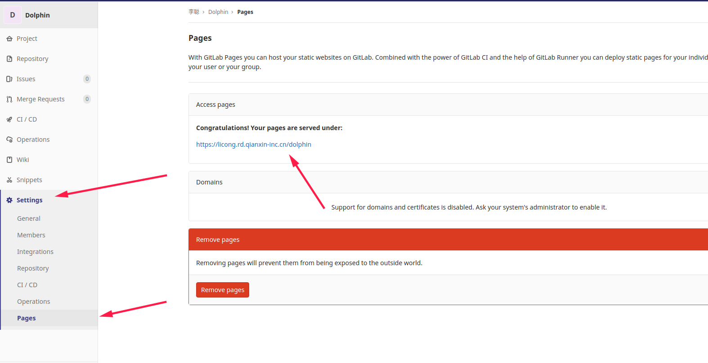
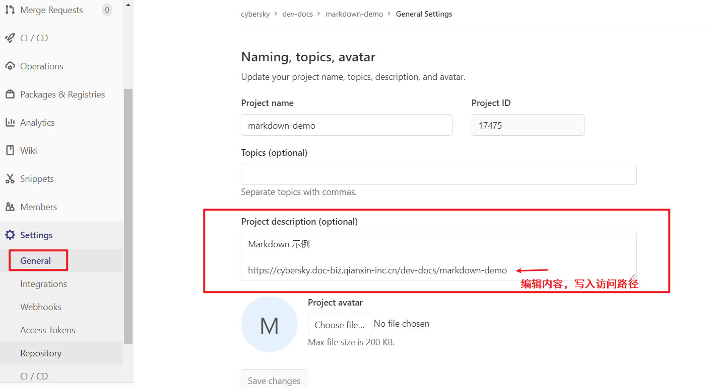
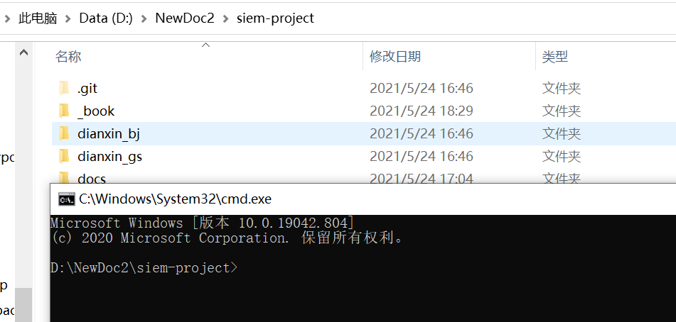
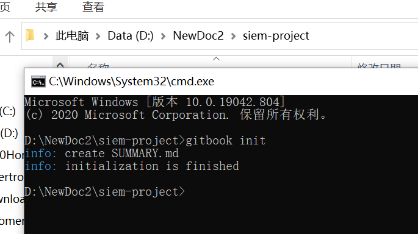
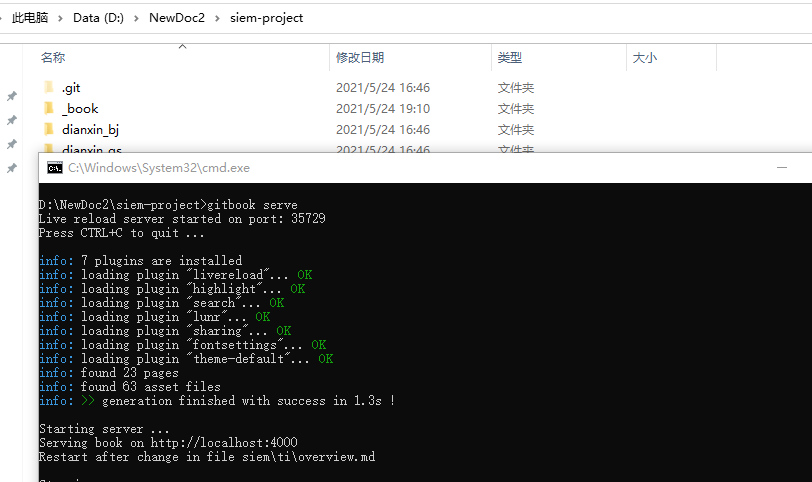

# markdown文档编写指南

## 配置

* 创建文件 `.gitlab-ci.yml`，内容如下：

```yml
pages:
  stage: deploy
  image: ats-fe-image.af-biz.qianxin-inc.cn/mdbook:1.0.0
  script:
    - mdbook build -d public
  artifacts:
    paths:
      - public
  only:
    - master
  tags:
    - k8s
```

> 以上为使用`mdbook`的例子，其他配置参考 [gitlab pages功能介绍](https://wiki.qianxin-inc.cn/pages/viewpage.action?pageId=179510472)

* 提交后，项目自动生成文档访问路径。如下图：




编辑项目描述，将访问路径添加到描述中，方便访问。




## mdbook使用

下载mdbook二进制文件 https://github.com/rust-lang/mdBook/releases

加入操作系统`Path`路径，命令行执行。

```
$ mdbook -h
mdbook v0.4.7
Mathieu David <mathieudavid@mathieudavid.org>
Creates a book from markdown files

USAGE:
    mdbook [SUBCOMMAND]

FLAGS:
    -h, --help       Prints help information
    -V, --version    Prints version information

SUBCOMMANDS:
    build    Builds a book from its markdown files
    clean    Deletes a built book
    help     Prints this message or the help of the given subcommand(s)
    init     Creates the boilerplate structure and files for a new book
    serve    Serves a book at http://localhost:3000, and rebuilds it on changes
    test     Tests that a book's Rust code samples compile
    watch    Watches a book's files and rebuilds it on changes
```


## gitbook使用（推荐）

1、安装nodejs（推荐10版本）

2、安装gitbook，命令行如下：

`npm install -g gitbook-cli`

3、到文档项目的根路径下，打开cmd命令行

<br><br>先执行：

`gitbook init`

结果如下：



再执行：

`gitbook serve`

结果如下：



最后浏览器访问 http://localhost:4000/ 即可。 

## 参考文章

* [mdbook手册](http://llever.com/mdBook-zh/print.html)

* [gitlab pages功能介绍](https://wiki.qianxin-inc.cn/pages/viewpage.action?pageId=179510472)

  
