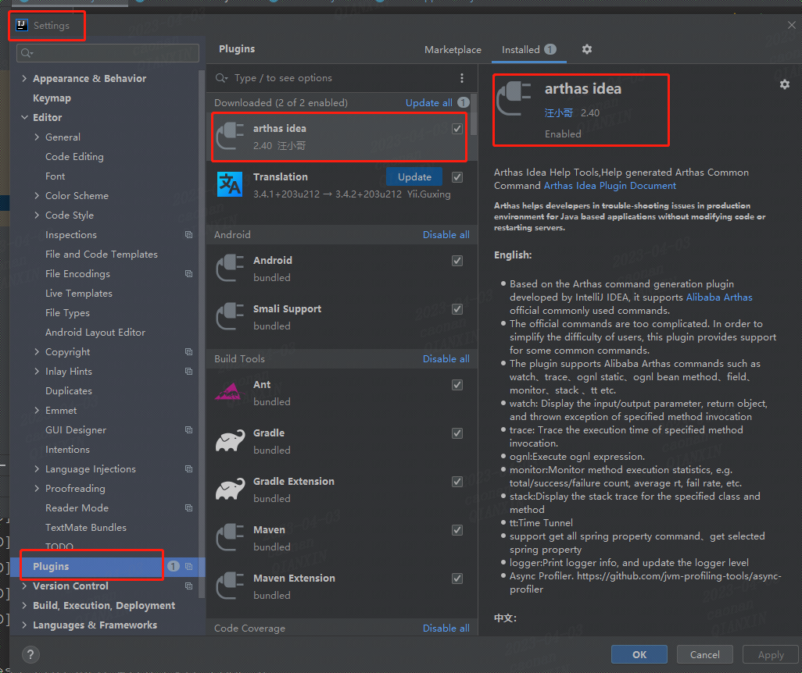
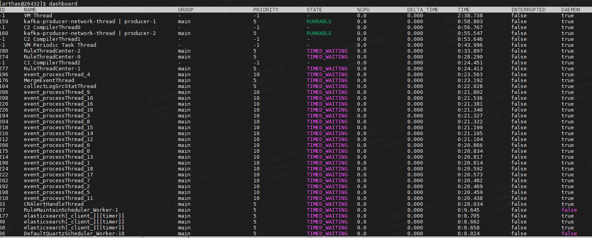
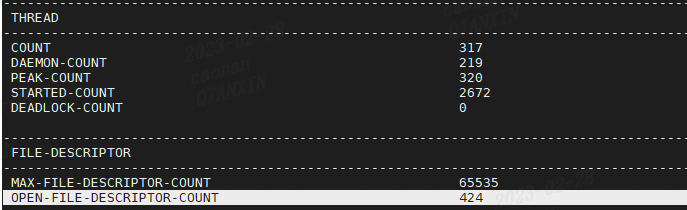
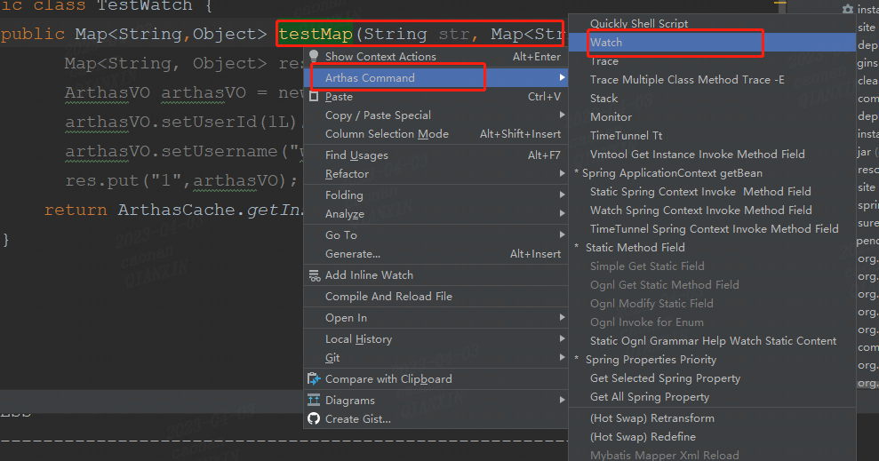
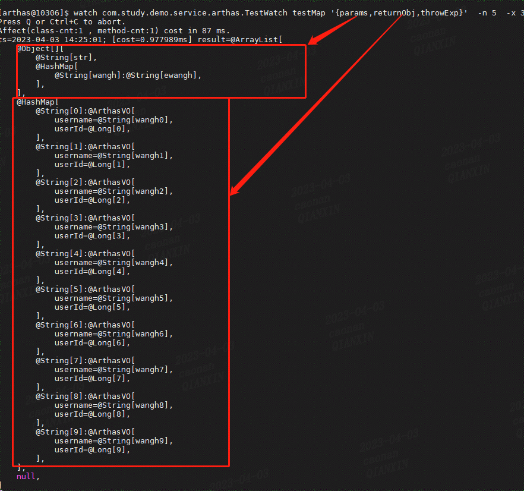
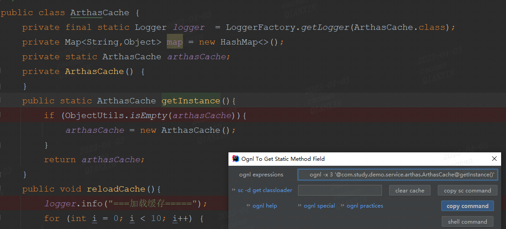
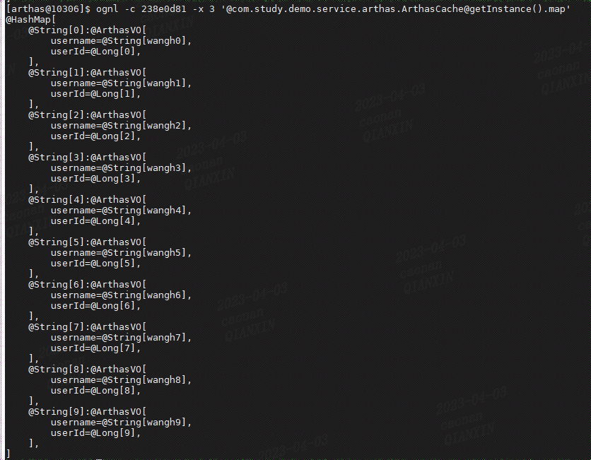

# 简介

一款线上监控诊断工具，实时查看应用load，内存，gc，线程状态信息；在不修改应用代码的前提下对业务问题进行诊断

# 安装

- 下载后解压上传至linux即可使用 [下载 | arthas](https://arthas.aliyun.com/doc/download.html)

- 启动：
  
      ./as.sh

- idea插件名称arthas idea
  
  

# 常用命令

## dashboard

- ID: Java 级别的线程 ID，注意这个 ID 不能跟 jstack 中的 nativeID 一一对应。

- NAME: 线程名

- GROUP: 线程组名

- PRIORITY: 线程优先级, 1~10 之间的数字，越大表示优先级越高

- STATE: 线程的状态

- CPU%: 线程的 cpu 使用率。比如采样间隔 1000ms，某个线程的增量 cpu 时间为 100ms，则 cpu 使用率=100/1000=10%

- DELTA_TIME: 上次采样之后线程运行增量 CPU 时间，数据格式为`秒`

- TIME: 线程运行总 CPU 时间，数据格式为`分:秒`

- INTERRUPTED: 线程当前的中断位状态

- DAEMON: 是否是 daemon 线程

## jvm

- COUNT: JVM 当前活跃的线程数
- DAEMON-COUNT: JVM 当前活跃的守护线程数
- PEAK-COUNT: 从 JVM 启动开始曾经活着的最大线程数
- STARTED-COUNT: 从 JVM 启动开始总共启动过的线程次数
- DEADLOCK-COUNT: JVM 当前死锁的线程
- MAX-FILE-DESCRIPTOR-COUNT：JVM 进程最大可以打开的文件描述符数
- OPEN-FILE-DESCRIPTOR-COUNT：JVM 当前打开的文件描述符数

## thread

- thread：按照cpu增量时间降序排列显示第一页

- thread --all :显示全部线程

- thread 线程id：查看线程运行堆栈信息

- thread -b 当前阻塞其他线程的线程

- thread -n 3 -i 1000：列出1000ms内占用cpu最高的3个线程

## watch

  查询某个方法的入参，返回值

## ognl

1. 查看某个缓存的值
   
   
   
   
   报错如下，解决方案如上指定classload（-c）参数；查询方式classloader -t
   
       [arthas@10306]$ ognl -x 3 '@com.study.demo.service.arthas.ArthasCache@getInstance().map'
       Failed to execute ognl, exception message: ognl.MethodFailedException: Method "getInstance" failed for object com.study.demo.service.arthas.ArthasCache [java.lang.ClassNotFoundException: Unable to resolve class: com.study.demo.service.arthas.ArthasCache], please check $HOME/logs/arthas/arthas.log for more details.

## trace

方法内部调用路径，并输出方法路径上的每个节点上耗时

    [arthas@10306]$ trace com.study.demo.controller.ArthasController testMap  -n 5 --skipJDKMethod false
    Press Q or Ctrl+C to abort.
    Affect(class-cnt:1 , method-cnt:1) cost in 33 ms.
    `---ts=2023-04-03 14:35:21;thread_name=http-nio-8080-exec-8;id=34;is_daemon=true;priority=5;TCCL=org.springframework.boot.web.embedded.tomcat.TomcatEmbeddedWebappClassLoader@3c19aaa5
        `---[0.218528ms] com.study.demo.controller.ArthasController:testMap()
            +---[0.016243ms] java.util.HashMap:<init>() #27
            +---[0.005917ms] java.util.HashMap:put() #28
            `---[0.019811ms] com.study.demo.service.arthas.TestWatch:testMap() #29
