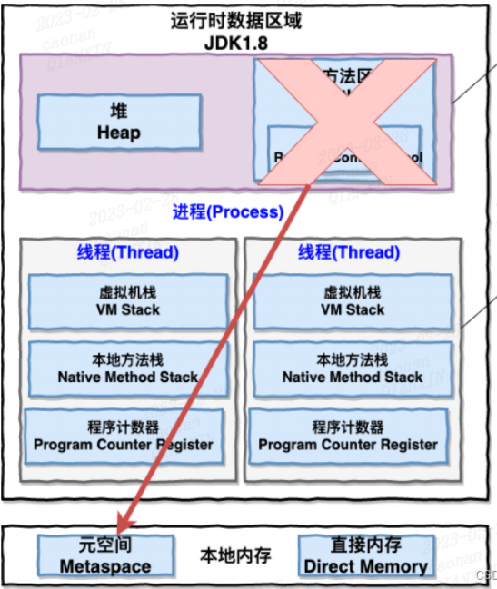
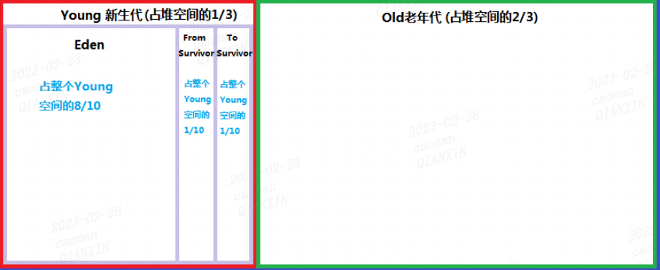
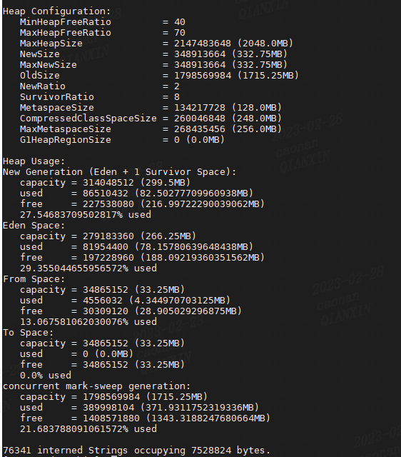
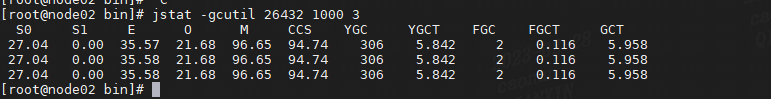

# 内存分析

## 内存模型

- 内存分类

- 堆：线程共享，new出来的对象都在这里，是垃圾回收的主要工作区域
  
  - 栈：线程私有，分为 Java 虚拟机栈和本地方法栈，存放局部变量表、操作栈、[动态链接](https://so.csdn.net/so/search?q=%E5%8A%A8%E6%80%81%E9%93%BE%E6%8E%A5&spm=1001.2101.3001.7020)、方法出口等信息，方法的执行对应着入栈到出栈的过程。
  
  - 方法区：线程共享，存放已被加载的类信息、常量、[静态变量](https://so.csdn.net/so/search?q=%E9%9D%99%E6%80%81%E5%8F%98%E9%87%8F&spm=1001.2101.3001.7020)、即时编译器编译后的代码等信息，JDK 1.8 中方法区被元空间取代，使用直接内存
  
  - **本地方法栈**：Native关键字，凡是被Native修饰的方法，都会去调用底层的C语言的库，会调用JNI接口（本地方法接口），比如，java驱动打印机打印
    
    - JNI的作用，就是为了拓展java的使用，融合不同的语言为java所用

- 堆内存

- 
  
  - minorGC：eden区域耗尽即触发
    
    - 复制清除方法：存在两个survivor区域是为了防止内存碎片化 详见：[新生代内存需要有两个Survivor区 S0、S1_彼岸-花已开的博客-CSDN博客_eden 为什么要s0和s1](https://blog.csdn.net/szw906689771/article/details/111588722)
  
  - fullGC：老年代或者方法区空间不足

## 常用分析ro命令

- ./jmap -heap 进程号
  
  - 
    
    - Heap Configuration：堆内存配置
      
      - HeapFreeRatio：堆使用比
      
      - MaxHeapSize：最大堆空间大小
      
      - NewSize：新生代大小
      
      - OldSize：老生代大小
      
      - PermSize：方法区大小
    
    - Heap Usage：堆使用情况
      
      - New Generation新生代
      
      - Eden Space
      
      - From Space
      
      - To Space
      
      - concurrent mark-sweep generation老生代
      
      - Perm Generation方法区
  
  - jstat -gcutil 进程号 时间间隔 收集次数
  
  - 
    
    - S0,S1 幸存区占比；E Eden区域占比；O老年区占比；M：元数据占比
    
    - CCS：压缩类使用占比
    
    - YGC：年轻代垃圾回收次数，YGCT:应用程序启动到现在，年轻代gc消耗时间
    
    - FGC：老年代垃圾回收次数，YGCT:应用程序启动到现在，老年代gc消耗时间
    
    - GCT：应用程序启动到现在，全部gc消耗时间
  
  - /jmap -F  -J-d64 -dump:format=b,file=heap.bin 进程id
    
    - 之后使用MemoryAnalyzer进行分析 (zip下MemoryAnalyzer-1.11.0.20201202-win32.win32.x86_64.zip)

# CPU分析

    cpu分析主要是分析占用cpu高的进程，然后定位线程，然后定位代码片段；其中涉及命令较为繁琐，借助于arthas工具进行分析

# # IO分析

# 网络分析
