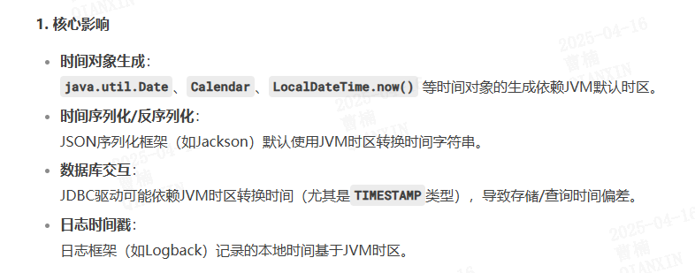
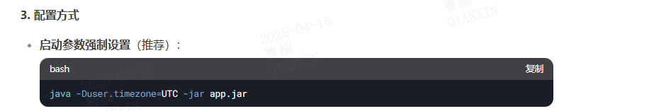
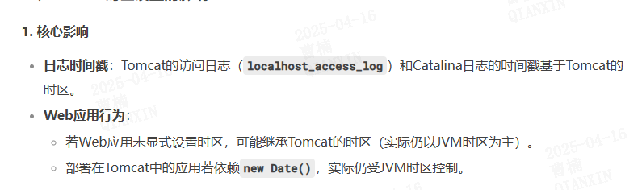
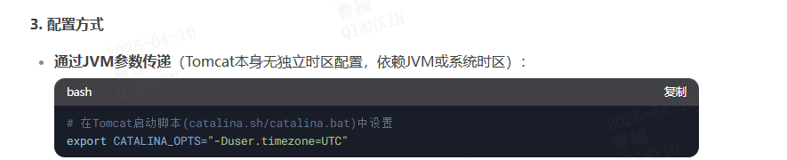
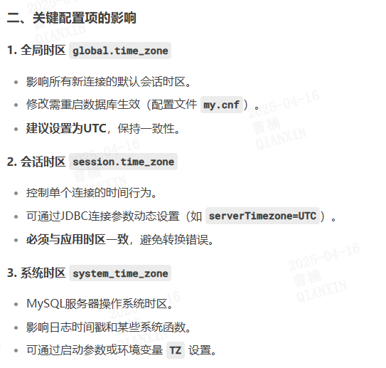

# 时区问题

## 操作系统时区：

## jvm时区：

tomcat时区：

## 数据库时区

  timestamp：存储时转换为utc存储、读取时根据会话时区转为客户端（会话）时区

  datetime：存储时原样存储应用传递的时间、读取时原样输出

  long时间戳（依赖应用、不受数据库时区限制）

- `NOW()`、`CURTIME()` 等函数返回的时间基于**当前会话时区**。

- `UTC_TIMESTAMP()` 始终返回UTC时间。

## docker时区

- docker ps
  CONTAINER ID IMAGE COMMAND CREATED STATUS PORTS NAMES
  c63d169ef285 cybertron-python:x86_64-1.0.0 "/data/soar/containe…" 3 months ago Up 3 months 127.0.0.1:16500->16500/tcp qax-soar-app
  8cb67a7e0791 cybertron-ocr:x86_64-1.0.0 "sh -c 'exec supervi…" 3 months ago Up 3 months 127.0.0.1:8089->8089/tcp qax-soar-ocr
  d8ec9015d8ee cybertron-chatbot-rasa:x86_64-1.0.0 "sh -c $APP_ROOT/she…" 3 months ago Up 3 months 127.0.0.1:5005-5006->5005-5006/tcp, 127.0.0.1:5055-5056->5055-5056/tcp qax-soar-chatbot

-  docker exec -it d8ec9015d8ee /bin/bash

-  ln -sf /usr/share/zoneinfo/Africa/Cairo /etc/localtime

- 对应的安装脚本中有时区同步的处理
  
  

