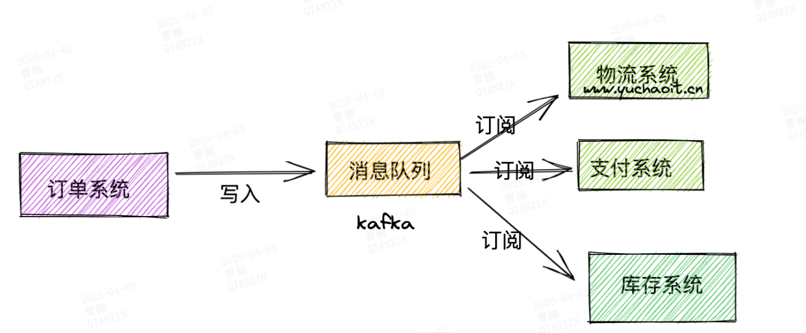

# 介绍

1. 消息中间件

2. 名词解释
   
   1. producer：生产者
   
   2. consumer：消费者
   
   3. topic ：消息队列分类 （逻辑概念）
   
   4. partition：分区（消息存储的物理实体）
   
   5. broker：物理节点
   
   6. replicas：副本
   
   7. leader主节
   
   8. follower：
      
      ```plaintext
                          Kafka Cluster
      +---------------------------------------------------+
      |  +----------+     +----------+     +----------+   |
      |  | Broker 1 |     | Broker 2 |     | Broker 3 |   |
      |  +----↑-----+     +-----↑----+     +-----↑----+   |
      |       |                 |                |        |
      |       | Partition 0     | Partition 1     | Partition 2
      |       | (Leader)        | (Leader)       | (Leader) 
      |       |                 |                |        |
      |  +----↓-----+     +-----↓----+     +-----↓----+   |
      |  |Replica P0|     |Replica P1|     |Replica P2|   |
      |  | (Follower)|     | (Follower)|    | (Follower)|  |
      |  +----------+     +----------+     +----------+   |
      +---------------------------------------------------+
                                ↑
                                | Topic: "order-events" (3 Partitions)
      
      ```
      
      

3. 优点
   
   1. Apache Kafka是一个分布式发布 - 订阅消息系统和一个强大的队列，可以处理大量的数据，并使您能够将消息从一个端点传递到另一个端点。
      
      点对点
      
      
      
      发布订阅
      
      
   
   2. Kafka适合离线和在线消息消费
   
   3. Kafka消息保留在磁盘上，并在群集内复制以防止数据丢失
   
   4. Kafka构建在ZooKeeper同步服务之上
   
   5. 它与Apache Storm和Spark非常好地集成，用于实时流式数据分析


