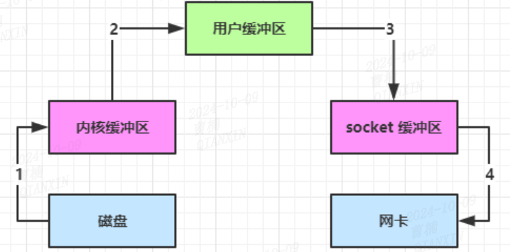
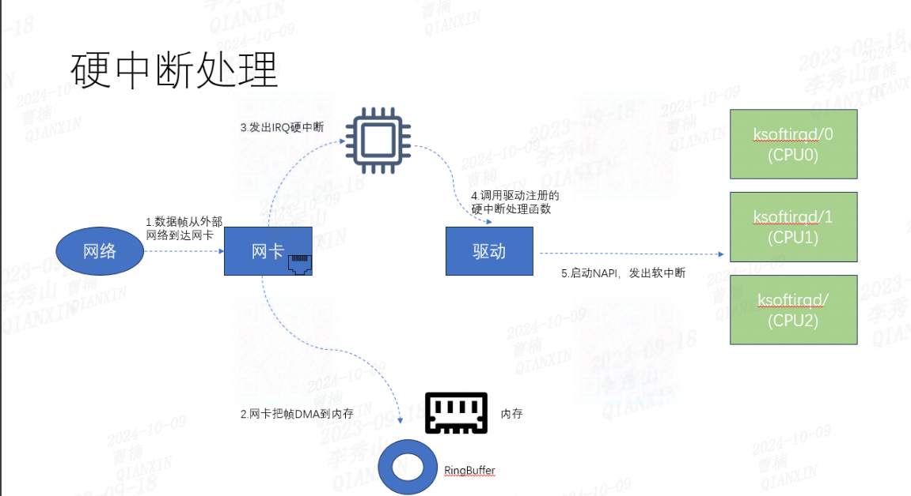
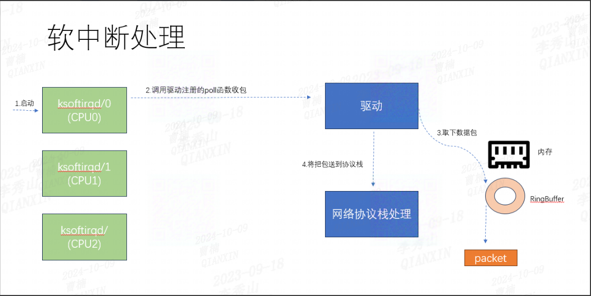
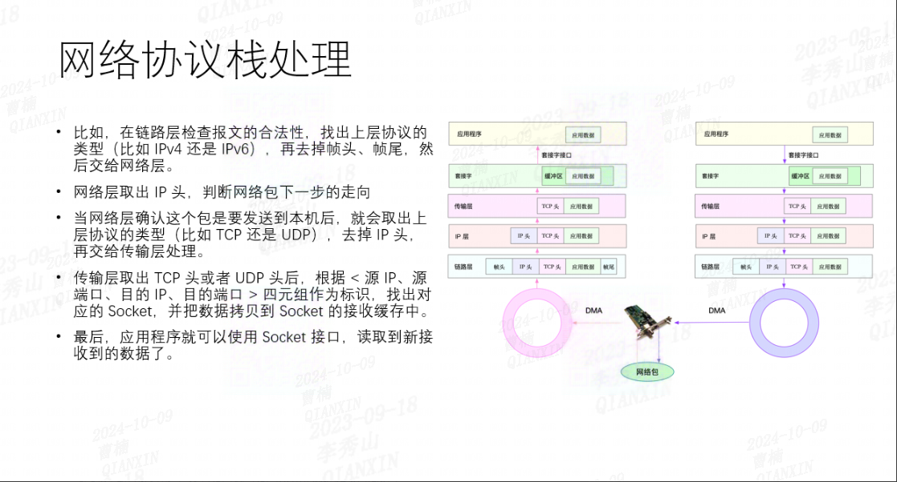
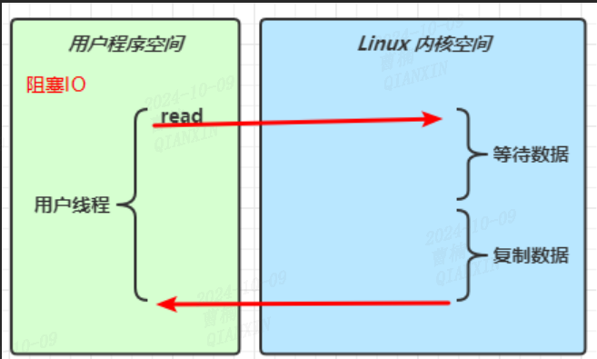
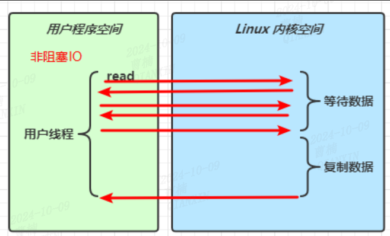
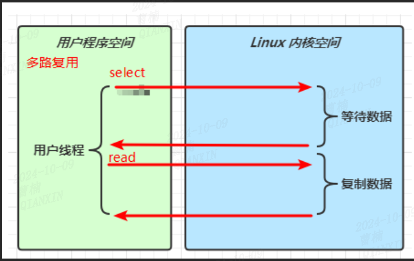
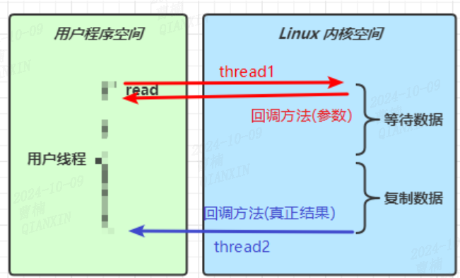

# io发展

## 前置知识

### 数据包接收过程



1. 数据帧从外部网络到达网卡

2. 网卡收到数据后以DMA的方式将帧写到内存

3. 硬中断通知CPU
   
   

4. CPU收到中断请求后调用网络设备驱动注册的中断处理函数，简单处理后发出软中断请求，然后迅速释放CPU
   
   
   
   > 软中断查询命令
   > 
   > ```
   > cat /proc/softirq      
   > ```
   > 
   > - HI：高优先级中断
   > 
   > - TIMER：时钟中断，用于周期性调度
   > 
   > - NET_TX，NET_RX：网络发送和接收中断
   > 
   > - BLOCK：块设备中断
   > 
   > - IRQ_POLL：轮询中断处理
   > 
   > - TASKLET：轻量级任务队列中断
   > 
   > - SCHED：调度中断
   > 
   > - HRTIMER：高分辨率定时器中断
   > 
   > - RCU：读取-更新锁中断

5. ksoftirqd内核线程检测到软中断请求到达，调用poll（网卡驱动程序注册的函数）开始轮询收包

6. 数据帧从RingBuffer上摘下来保存为一个skb（struct sk_buff对象的简称，是Linux网络模块中的核心数据结构体，各个层用到的数据包都是存在这个结构体里的）

7. 将包交由各级协议层处理，处理完后放到socket的接收队列
   
   

8. 内核唤醒用户进程

## 阻塞io（BIO）

### 基本概念



### 基本使用


## 非阻塞io（NIO）

### 基本概念



## io多路复用（select-poll/epoll）

> 很多人都说，IO 多路复用是用一个线程来管理多个网络连接，但本人不太认可，因为在非阻塞 IO 时，就已经可以实现一个线程处理多个网络连接了，这个是由于其非阻塞而决定的。
> 
> 个人认为，多路复用主要复用的是通过有限次的系统调用来实现管理多个网络连接。最简单来说，我目前有 10 个连接，我可以通过一次系统调用将这 10 个连接都丢给内核，让内核告诉我，哪些连接上面数据准备好了，然后我再去读取每个就绪的连接上的数据。因此，IO 多路复用，复用的是系统调用。通过有限次系统调用判断海量连接是否数据准备好了。
> 
> 无论下面的 select、poll、epoll，其都是这种思想实现的，不过在实现上，select/poll 可以看做是第一版，而 epoll 是第二版**



### 基本使用

## 异步io（AIO）

`在目前所有的操作系统中，linux 中的 epoll、mac 的 kqueue 都属于同步 IO，因为其在第二阶段(数据从内核态到用户态)都会发生拷贝阻塞。而只有 windows 中的 IOCP 才真正属于异步 IO，即 AIO。`



## 参考文件

[​网络 IO 演变发展过程和模型介绍-腾讯云开发者社区-腾讯云](https://cloud.tencent.com/developer/article/1793196?utm_id=gwzcw.6511354.6511354.6511354)

# 丢包分析

### 网卡丢包

    ifconfig 网卡名
    ip -s addr show dev 网卡名


- errors 表示发生错误的数据包数，比如校验错误、帧同步错误等；
- dropped 表示丢弃的数据包数，即数据包已经收到了 Ring Buffer，但因为内存不足等原因丢包；
- overruns 表示超限数据包数，即网络 I/O 速度过快，导致 Ring Buffer 中的数据包来不及处理（队列满）而导致的丢包；
- carrier 表示发生 carrirer 错误的数据包数，比如双工模式不匹配、物理电缆出现问题等；
- collisions 表示碰撞数据包数。 

### 内核丢包

如果网络堆栈无法处理传入流量，则内核会丢弃网络数据包。如果errors的值较大，并且持续增长，说明内核可能存在丢包现象。

    netstat –s


    nstat -az UdpSndbufErrors UdpRcvbufErrors


### 丢包优化

1. 调整网卡RingBuffer大小
   
   `盲目调大RingBuffer不一定有用，只有在网卡中overruns指标增长时，有包因为RingBuffer装不下而被丢弃，调大RingBuffer才是有用的`。
   
   `副作用：调大RingBuffer会增加处理网络包的延时`

2. 多队列网卡RSS调优
   
       ethtool -l ens192

3. 软中断budget调整
   
      sysctl -a | grep net.core.netdev_budget

4. 接收处理合并
   
   `硬中断合并是指攒一堆数据包后再通知一次CPU`
   
   `LRO(large-receive-offload)：在网卡上进行合并，需要硬件支持`
   
   `GRO(generic-receive-offload)：在内核中以软件的方式进行合并`
   
       ethtool -k ens33 | grep receive
       
       generic-receive-offload: on
       
       large-receive-offload: off [fixed]

## 参考文献

1. [调优网络性能](https://access.redhat.com/documentation/zh-cn/red_hat_enterprise_linux/9/html/monitoring_and_managing_system_status_and_performance/tuning-the-network-performance_monitoring-and-managing-system-status-and-performance)
2. [packetloss.html](https://ultramessaging.github.io/currdoc/doc/Design/packetloss.html)
3. [verify_loss.pdf](https://wiki.qianxin-inc.cn/download/attachments/784029485/verify_loss.pdf?version=1&modificationDate=1694423862000&api=v2)
