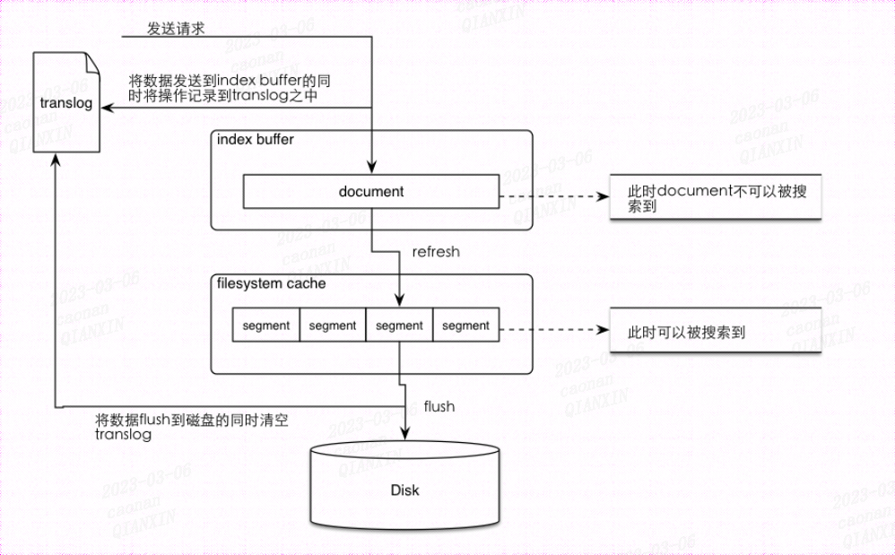
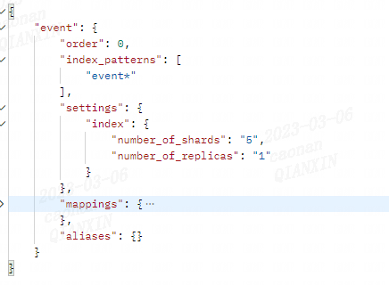

# curl操作

## 通用语句

- 多个索引共同搜索
  
  - `test* 或者*test 或者test*t 或者 *test*或者-test`   (-)是排除

- 日志格式支持
  
  - <静态文本{动态的时间表达式{日期呈现格式|时区}}>
    
    - 最近三天 
    
    ```
    # GET /<logstash-{now/d-2d}>,<logstash-{now/d-1d}>,<logstash-{now/d}>/_search
    GET /%3Clogstash-%7Bnow%2Fd-2d%7D%3E%2C%3Clogstash-%7Bnow%2Fd-1d%7D%3E%2C%3Clogstash-%7Bnow%2Fd%7D%3E/_search
    {
      "query" : {
        "match": {
          "test": "data"
        }
      }
    }
    ```

- 格式化结果
  
  - ?pretty=true
  
  - ?format=yaml
  
  - ?human=false

- 过滤显示结果的字段
  
  - 示例 curl -X GET "localhost:9200/_search?q=elasticsearch&filter_path=took,-_shards，hits.hits._id,hits.hits._score&pretty"

## 常用配置

### 通配符启用

action.destructive_requires_name

### 自动创建索引

action.auto_create_index：新增文档的时候，如果索引不存在是报错还是自动创建

## 数据类型

### 字符串

- text
  
  - 会分词后进行索引
  
  - 支持模糊，精确查询
  
  - 不支持聚合

- keyword
  
  - 不进行分词，直接索引
  
  - 支持模糊，精确查询
  
  - 支持聚合

- 混用:可以使用name字段进行模糊查询和分词，name.keyword进行聚合
  
  - ```
    curl --location --request PUT 'localhost:31600/testmapping3' \
    --header 'Content-Type: application/json' \
    --data '{
      "mappings": {
        "_doc": {
          "properties": {
            "name": {
              "type": "text",
              "fields":{
                  "keyword":{
                      "type":"keyword"
                  }
              }
            }
          }
        }
      }
    }'
    ```

### 数字

- long，integer，short，byte

- double，float，half_float,scaled_float

### 日期

- ```
  curl -X PUT "localhost:9200/my_index?pretty" -H 'Content-Type: application/json' -d'
  {
    "mappings": {
      "_doc": {
        "properties": {
          "date": {
            "type":   "date",
            "format": "strict_date_optional_time||yyyy-MM-dd HH:mm:ss||yyyy-MM-dd||epoch_millis"
          }
        }
      }
    }
  }
  '
  ```

- strict_date_optional_time严格的年月日格式：仅支持"yyyy-MM-dd"、"yyyyMMdd"、"yyyyMMddHHmmss"、"yyyy-MM-ddTHH:mm:ss"、"yyyy-MM-ddTHH:mm:ss.SSS"、"yyyy-MM-ddTHH:mm:ss.SSSZ"格式
  
  不支持常用的"yyyy-MM-dd HH:mm:ss"等格式。注意，"T"和"Z"是固定的字符

- epoch_millis时间的ms值

- Boolean布尔：true，“true”

- 二进制
  
  - 可以存储base64编码字符串，默认不支持检索和store
    
    - store就是独立于source之外单独存储一份数据，如果数据量太大，可以store存储，source不在存储，获取时指定只获取source可以减少数据量
    
    - [doc_values]可以指定是否要支持检索

### 区间类型

- integer_range,long__range,float_range,double_range,date_range
  
  - ```
    -- 创建索引
    curl -X PUT "localhost:9200/range_index?pretty" -H 'Content-Type: application/json' -d'
    {
      "settings": {
        "number_of_shards": 2
      },
      "mappings": {
        "_doc": {
          "properties": {
            "expected_attendees": {
              "type": "integer_range"
            },
            "time_frame": {
              "type": "date_range", 
              "format": "yyyy-MM-dd HH:mm:ss||yyyy-MM-dd||epoch_millis"
            }
          }
        }
      }
    }
    '
    -- 插入数据
    curl -X PUT "localhost:9200/range_index/_doc/1?refresh&pretty" -H 'Content-Type: application/json' -d'
    {
      "expected_attendees" : { 
        "gte" : 10,
        "lte" : 20
      },
      "time_frame" : { 
        "gte" : "2015-10-31 12:00:00", 
        "lte" : "2015-11-01"
      }
    }
    '
    
    -- 查询
    curl --location --request GET 'localhost:31600/testmapping3/_doc/_search' \
    --header 'Content-Type: application/json' \
    --data '{
      "query": {
        "range": {
          "expected_attendees": {
            "gte":"1",
            "lte":"11",
             "relation" : "CONTAINS" 
          }
        }
      }
    }'
    ```
  
  - relation关系
    
    - intersects查询和文档存 储范围有交叉即可（默认）
    
    - within 文档范围在查询范围内
    
    - contains 文档范围包含查询范围

### 复杂类型

- Array数组
  
  - 设置mapping的时候无需指定arrays类型，但是long，text等都支持多值，但是必须类型一样，或者是可以进行强制类型转换

- Object对象

- Nested类型：一种可以让层级对应各自索引查询的object对象，和object的不同见
  
  详细见：[Nested datatype | Elasticsearch Guide [6.8] | Elastic](https://www.elastic.co/guide/en/elasticsearch/reference/6.8/nested.html)[Nested datatype | Elasticsearch Guide [6.8] | Elastic](https://www.elastic.co/guide/en/elasticsearch/reference/6.8/nested.html)

### 特定类型

- GEO地理位置
  
  - Geo-point：一个经纬度确定的点
    
    - 字符串是纬度，经度；数组是经度，纬度
    
    - ```
      // 1）geo_bounding_box_shape经纬确定的矩形
      GET location/_search
      {
        "query": {
          "geo_bounding_box": {
            "locationStr": {
              "top_left": [116.498353, 40.187328],
              "bottom_right": [116.610461, 40.084509]
            }
          }
        }
      }
      //2)geo_distance 选中中心点和半径进行查询
      GET location/_search
      {
        "query": {
          "geo_distance": {
            "distance": "5km",
            "locationStr": "40.174697,116.5864"
          }
        },
        "sort": [
          {
            "_geo_distance": {
              "locationStr": "40.174697,116.5864",
              "order": "asc",
              "unit": "km",
              "distance_type": "plane"
            }
          }
        ]
      }
      //返回
      {
          "_index" : "location",
          "_type" : "_doc",
          "_id" : "2",
          "_score" : null,
          "_source" : {
            "locationStr" : "40.19103839805197,116.5624013764374"
          },
          "sort" : [
            2.7309695122568725 //距离目标地点的直线距离
          ]
        }
      
      　//　3）geo_polygon多边形查询
      GET location/_search
      {
        "query": {
          "geo_polygon": {
            "locationStr": {
              "points": [
                "40.178012,116.577188",
                "40.169329, 116.586315",
                "40.178288, 116.591813"
              ]
            }
          }
        }
      }
      
      　　4）geo_shape查询（查询两个地理位置形状的位置关系）
      GET /my_index_geo_shape/_search
      {
          "query":{
              "bool": {
                  "must": {
                      "match_all": {}
                  },
                  "filter": {
                      "geo_shape": {
                          "location": {
                              "shape": {
                                  "type": "envelope",
                                  "coordinates" : [[116.327854,39.90075], [117.065057,39.063287]]
                              },
                              "relation": "within"
                          }
                      }
                  }
              }
          }
      }
      INTERSECTS - 和查询位置橡胶的存储位置。
      DISJOINT - 和查询位置完全无交集的存储位置
      WITHIN - 查询几何图形包含的所有存储集合
      CONTAINS - 存储集合包含查询几何图形的所有文档。
      ```

```
    ```

- Geo-shape：一个经纬度确定的点，一个中心点+半径确定的圆，多个点确定的多边形
```

- IP类型
  
  - 支持ipv4和ipv6类型
  
  - ```
    curl -X GET "localhost:9200/my_index/_search?pretty" -H 'Content-Type: application/json' -d'
    {
      "query": {
        "term": {
          "ip_addr": "192.168.0.0/16"
        }
      }
    }
    '
    CIDR 表示法: [ip_address]/[prefix_l
    ```

- completion自动补全类型

- token_count令牌计数类型：是一个int类型，接受字符串值，然后索引字符串中标记数
  
  - ```
    curl -X PUT "localhost:9200/my_index?pretty" -H 'Content-Type: application/json' -d'
    {
      "mappings": {
        "_doc": {
          "properties": {
            "name": { 
              "type": "text",
              "fields": {
                "length": { 
                  "type":     "token_count",
                  "analyzer": "standard"
                }
              }
            }
          }
        }
      }
    }
    '
    curl -X PUT "localhost:9200/my_index/_doc/1?pretty" -H 'Content-Type: application/json' -d'
    { "name": "John Smith" }
    '
    curl -X PUT "localhost:9200/my_index/_doc/2?pretty" -H 'Content-Type: application/json' -d'
    { "name": "Rachel Alice Williams" }
    '
    curl -X GET "localhost:9200/my_index/_search?pretty" -H 'Content-Type: application/json' -d'
    {
      "query": {
        "term": {
          "name.length": 3 
        }
      }
    }
    '
    返回Rachel Alice Williams
    ```

- percolator父子索引：//TODO

- alias别名

## 索引操作

### 创建索引

- 请求体
  
  ```
  curl -X PUT "localhost:9200/test?pretty" -H 'Content-Type: application/json' -d'
  {
      "settings" : {
           "number_of_shards" : 3,//主分片
          "number_of_replicas" : 2//副本数量
      },
      "mappings" : {
          "_doc" : {//7.0以后没有type的概念了，所以这个可以不用写了
              "properties" : {
                  "field1" : { "type" : "text" }//字段和类型
              }
          }
      },
     "aliases" : {//索引别名
          "alias_1" : {},
          "alias_2" : {
              "filter" : {
                  "term" : {"user" : "kimchy" }
              },
              "routing" : "kimchy"
          }
      }
  }
  '
  ```
  
  - setting设置详解见 [Index Modules | Elasticsearch Guide [6.8] | Elastic](https://www.elastic.co/guide/en/elasticsearch/reference/6.8/index-modules.html) TODO
  
  - mapping详情可参见数据类型
  
  - aliases TODO

- 返回体
  
  
  
  - acknoledged：索引是否创建成功；为false不一定是失败了，因为可能只是请求超时了，超时之后可能依旧成功了
  
  - shards_acknowledged：每个主分片是否有足够的副本复制；为false不一定是失败了，因为可能只是请求超时了，超时之后可能依旧成功了

### 删除索引

- 请求体

```
curl -X DELETE "localhost:9200/twitter?pretty"
```

- 返回体

```
{"acknowledged": true}
```

### 更新索引

#### open/close索引

- 请求体
  
  ```
  curl -X POST "localhost:9200/my_index/_close?ignore_unavailable=true&pretty"
  curl -X POST "localhost:9200/my_index/_open?pretty"
  ```
  
  - ignore_unavailable=true：索引不存在也不报错
  
  - **close的索引不占用内存资源，占用磁盘资源；但是不要长时间保留close的索引，因为在节点进行扩容删除的时候close索引的数据是不会重新分配的，会导致数据丢失**

- 返回体：参见创建索引

#### shrink/split索引

- shrink索引
  
  某类数据量很小，但是分片数量比较庞大，降低集群整体的性能
  
  - 操作条件
    
    - 目标索引不存在
    
    - 源索引比目标索引有更多的主分片，目标索引是源索引的一个系数，质数只能压缩为1个主分片
    
    - 所有分片的包含文档数量不超过2,147,483,519
    
    - 磁盘空间足够
  
  - 操作步骤
    
    ```
    curl -X PUT "localhost:9200/my_source_index/_settings?pretty" -H 'Content-Type: application/json' -d'
    {
      "settings": {
    //重新定位索引分片到某个节点（所有分片需要定位到同一个节点-同一个硬盘）
        "index.routing.allocation.require._name": "shrink_node_name", 
        "index.blocks.write": true //禁止写操作
      }
    }
    '
    ```
    
    ```
    url -X POST "localhost:9200/my_source_index/_shrink/my_target_index?copy_settings=true&pretty" -H 'Content-Type: application/json' -d'
    
    {
      "settings": {
        "index.routing.allocation.require._name": null,//清除定位要求
        "index.blocks.write": null,//清除禁止写操作同步
        "index.number_of_replicas": 1,//目标副本
        "index.number_of_shards": 1,//目标主分片
        "index.codec": "best_compression"
      },
      "aliases": {//别名
        "test4_new_alias": {}
      }
    
    }
    ```

- split
  
  初期因为对数据量评估不足，导致分片数量太小，单分片数据量太大，索引能力太低
  
  - 操作条件
    
    - 目标索引不存在
    
    - 索引的主分片比目标索引的主分片少，且目标索引的主分片数量是原索引主分片数量的倍数
    
    - number_of_routing_shards最大能扩充的数量，设置才可以扩充，乘系数扩充
    
    - 有足够的磁盘空间容纳现有索引的第二个副本
  
  - 操作步骤
    
    - ```
      curl -X PUT 'localhost:31600/twitter4_new/_settings' 
      -H 'Content-Type: application/json' 
      -d '
      {
        "settings": {
          "index.blocks.write": true
        }
      }'
      ```
    
    - ```
      curl -X POST 'localhost:31600/ti_v0/_split/ti_v0_spilut' \
      --header 'Content-Type: application/json' \
      --data '
      {
        "settings":{
          "index.number_of_shards":10
        }
      
      }'
      ```

#### mapping相关

- 查询
  
  ```
  curl -X GET "localhost:9200/{索引名称}/_mapping/{类型名称}?pretty"
  curl -X GET "localhost:9200/{索引名称}/_mapping/{类型名称}/field/{字段名称}?pretty"
  ```
  
  - 可以使用通配符

- 修改
  
  ```
  curl -X PUT "localhost:9200/twitter/_mapping/_doc?pretty" -H 'Content-Type: application/json' -d'
  {
    "properties": {
      "email": {
        "type": "keyword"
      }
    }
  }
  '
  ```
  
  - 可以增加已存在索引mapping的字段
  
  - 已存在字段不可修改，例外情况如下：object类型扩充，属性扩展；详见[Mapping parameters | Elasticsearch Guide [6.8] | Elastic](https://www.elastic.co/guide/en/elasticsearch/reference/6.8/mapping-params.html)

#### settings相关

- 查询
  
  ```
  curl -X GET "localhost:9200/twitter/_settings/{setting的名称}"
  ```

- 更新
  
  ```
  curl -X PUT "localhost:9200/twitter/_settings?pretty" -H 'Content-Type: application/json' -d'
  {
      "index" : {
          "refresh_interval" : "-1"
      }
  }
  '
  ```
  
  - 批量操作时更新refresh的间隔
  
  - 增加分词器
  
  - 增加副本等等

### 查询索引

###### 查询是否存在

`curl -I "localhost:9200/twitter?pretty"` 200表示索引存在，404表示索引不存在

###### 查询详细信息

- 请求体
  
  ```
  curl -X GET "localhost:9200/twitter?pretty"
  ```
  
  - 可以使用通配符
  
  - include_type_name=false 返回去除type（7.0以后无类型说法）

- 返回体：参考创建索引

###### flush&refresh



- 数据写入buffer缓存区和translog日志当中

- buffer满了或者间隔1s，讲buffer中的内容写入文件系统cache中，然后清空buffer继续使用（refresh）

- translog达到一定条数或者30min之后，段内存数据刷入磁盘，translog被清空，创建新的translog

- segment每refresh一次都会产生新的，segement过多会导致索引过慢，所以es会对segment进行合并，合并过程中会将原本.del的记录进行真正的删除操作
  
  ```
  //flush
  curl -X POST "localhost:9200/twitter/_flush?pretty"
  //synced flush
  curl -X POST "localhost:9200/twitter/_flush/synced?pretty"
  // refresh
  curl -X POST "localhost:9200/twitter/_refresh?pretty"
  //merge
  curl -X POST "localhost:9200/twitter/_forcemerge?pretty"
  ```

###### 索引恢复

```
curl -X GET "localhost:9200/{索引}/_recovery?human&detailed=true&pretty"
```

  索引恢复是es数据恢复的过程，master节点挂掉，集群重新都会触发索引恢复过程；主要处理客户端写入成功，但是为进行flush的lucene分段

- 主分片恢复流程：从translog中自我重建segment恢复，
  
  - init:恢复尚未启动，从恢复那刻起被标记为init阶段
  
  - index：从lucene读取最后一次提交的分段信息，版本号；更新当前索引版本
  
  - verify_index：索引验证（不执行，数据量太大会很耗时）
  
  - translog：根据最后一次提交信息快照，确定那些数据需要重放；重放完毕后讲新的lucene数据刷入磁盘
  
  - finalize：执行refresh操作，缓冲数据写入文件，不刷盘，数据保存再cache中
  
  - done：之前再次执行refresh，然后更新分片状态

- 副本分片恢复流程
  
  - - init:本阶段是在副本节点执行的，其把恢复任务开始时设置为INIT阶段，其副本准备向主分片节点发送StartRecoveryRequest的请求，其请求中包含本次要恢复的shard相关信息，如shardId等
    
    - index：主要负责将分片的Lucene数据复制到副分片中（中间不阻塞索引请求，所以后面需要重放translog）
      
      - 如果可以基于恢复请求中的SequenceNumber进行恢复，则跳过该阶段
      
      - 如果主副分片有相同的synid且doc数量相同，则跳过该阶段（synced flush）
    
    - verify_index：索引验证（不执行，数据量太大会很耗时）
    
    - translog：主要是讲主分片的translog数据发送到副分片节点进行重放
    
    - finalize，done：参加主副本

###### 状态查询  TODO

```
请求
curl -X GET "localhost:9200/{索引名称}/_stats?pretty"
返回 详见https://blog.csdn.net/qq_27818541/article/details/112909576
{
    "_shards": {
        "total": 10,//分片总数
        "successful": 5,//成功返回数
        "failed": 0//失败返回数
    },
    "_all": {
        "primaries": {//主分片统计信息
            "docs": {
                "count": 0,
                "deleted": 0
            },
            "store": {
                "size_in_bytes": 1305//存储数据所占字节
            },
            "indexing": {
                "index_total": 0,//索引总次数
                "index_time_in_millis": 0,//索引操作总耗时
                "index_current": 0,//当前正在执行索引操作的个数
                "index_failed": 0,//失败的索引操作次数
                "delete_total": 0,// 执行删除索引操作的次数
                "delete_time_in_millis": 0,        // 删除索引操作总耗时
                "delete_current": 0,// 当前正在执行删除索引操作的个数
                "noop_update_total": 0,// 空更新总次数（检测到空更新的次数
                "is_throttled": false,// 索引是否处在merge throttling control（合并节流控制状态）
                "throttle_time_in_millis": 0 // 索引处在merge throttling control(合并节流状态)的时间开销
            },
            "get": {
                "total": 0, //  get api总调用次数
                "time_in_millis": 0, // get api总耗时。
                "exists_total": 0, // 命中的次数
                "exists_time_in_millis": 0,  // 命中的操作总耗时
                "missing_total": 0,// 未命中的总次数
                "missing_time_in_millis": 0,
                "current": 0// 当前正在执行的个数
            },
            "search": {
                "open_contexts": 0, // 正在打开的查询上下文个数
                "query_total": 15,// 查询出来的总数据条数
                "query_time_in_millis": 0,// 查询阶段所耗费的时间
                "query_current": 0,// 当前正在查询个数
                "fetch_total": 0, // Fetch操作的次数
                "fetch_time_in_millis": 0,
                "fetch_current": 0,  // 正在fetch的次数
                "scroll_total": 0,  // 通过scroll api查询数据总条数
                "scroll_time_in_millis": 0,
                "scroll_current": 0,
                "suggest_total": 0,  // 通过suggest api获取的推荐总数量
                "suggest_time_in_millis": 0,
                "suggest_current": 0
            },
            "merges": {
                "current": 0,
                "current_docs": 0,
                "current_size_in_bytes": 0,
                "total": 0,
                "total_time_in_millis": 0,
                "total_docs": 0,
                "total_size_in_bytes": 0,
                "total_stopped_time_in_millis": 0,
                "total_throttled_time_in_millis": 0,
                "total_auto_throttle_in_bytes": 104857600
            },
            "refresh": {
                "total": 15,
                "total_time_in_millis": 0,
                "listeners": 0
            },
            "flush": {
                "total": 5,
                "periodic": 0,
                "total_time_in_millis": 0
            },
            "warmer": {
                "current": 0,
                "total": 5,
                "total_time_in_millis": 0
            },
            "query_cache": {
                "memory_size_in_bytes": 0,
                "total_count": 0,
                "hit_count": 0,
                "miss_count": 0,
                "cache_size": 0,
                "cache_count": 0,
                "evictions": 0
            },
            "fielddata": {
                "memory_size_in_bytes": 0,
                "evictions": 0
            },
            "completion": {
                "size_in_bytes": 0
            },
            "segments": {
                "count": 0, // 该索引目前拥有的总段数
                "memory_in_bytes": 0,// 该索引缓存在内存中字节数
                "terms_memory_in_bytes": 0, // 倒排索引(term)缓存在内中所占字节数
                "stored_fields_memory_in_bytes": 0, // 该索引定义为stored_fields字段在内存中缓存的字节数
                "term_vectors_memory_in_bytes": 0,// 该索引term_vectors(词向量)在内存中所占字节数量
                "norms_memory_in_bytes": 0, // 该索引存储对应norms=true的字段当前在内存中缓存字节数
                "points_memory_in_bytes": 0,  // 与地理位置相关的缓存数据
                "doc_values_memory_in_bytes": 0,  // 设置为doc_values缓存在内存中的字节数（doc_values,列式存储）
                "index_writer_memory_in_bytes": 0,  // 用于优化索引写的缓存（减少写磁盘的频率
                "version_map_memory_in_bytes": 0,   // 关于文档的版本映射所占内存大小
                "fixed_bit_set_memory_in_bytes": 0, // fixed_bit_set内存，专门用来做nested查询的
                "max_unsafe_auto_id_timestamp": -1, // fixed_bit_set内存，专门用来做nested查询的
                "file_sizes": {}
            },
            "translog": {
                "operations": 0,
                "size_in_bytes": 1375,
                "uncommitted_operations": 0,
                "uncommitted_size_in_bytes": 1375,
                "earliest_last_modified_age": 0
            },
            "request_cache": {
                "memory_size_in_bytes": 0,
                "evictions": 0,
                "hit_count": 0,
                "miss_count": 0
            },
            "recovery": {
                "current_as_source": 0,
                "current_as_target": 0,
                "throttle_time_in_millis": 0
            }
        },
        "total": {
            "docs": {
                "count": 0,
                "deleted": 0
            },
            "store": {
                "size_in_bytes": 1305
            },
            "indexing": {
                "index_total": 0,
                "index_time_in_millis": 0,
                "index_current": 0,
                "index_failed": 0,
                "delete_total": 0,
                "delete_time_in_millis": 0,
                "delete_current": 0,
                "noop_update_total": 0,
                "is_throttled": false,
                "throttle_time_in_millis": 0
            },
            "get": {
                "total": 0,
                "time_in_millis": 0,
                "exists_total": 0,
                "exists_time_in_millis": 0,
                "missing_total": 0,
                "missing_time_in_millis": 0,
                "current": 0
            },
            "search": {
                "open_contexts": 0,
                "query_total": 15,
                "query_time_in_millis": 0,
                "query_current": 0,
                "fetch_total": 0,
                "fetch_time_in_millis": 0,
                "fetch_current": 0,
                "scroll_total": 0,
                "scroll_time_in_millis": 0,
                "scroll_current": 0,
                "suggest_total": 0,
                "suggest_time_in_millis": 0,
                "suggest_current": 0
            },
            "merges": {
                "current": 0,
                "current_docs": 0,
                "current_size_in_bytes": 0,
                "total": 0,
                "total_time_in_millis": 0,
                "total_docs": 0,
                "total_size_in_bytes": 0,
                "total_stopped_time_in_millis": 0,
                "total_throttled_time_in_millis": 0,
                "total_auto_throttle_in_bytes": 104857600
            },
            "refresh": {
                "total": 15,
                "total_time_in_millis": 0,
                "listeners": 0
            },
            "flush": {
                "total": 5,
                "periodic": 0,
                "total_time_in_millis": 0
            },
            "warmer": {
                "current": 0,
                "total": 5,
                "total_time_in_millis": 0
            },
            "query_cache": {
                "memory_size_in_bytes": 0,
                "total_count": 0,
                "hit_count": 0,
                "miss_count": 0,
                "cache_size": 0,
                "cache_count": 0,
                "evictions": 0
            },
            "fielddata": {
                "memory_size_in_bytes": 0,
                "evictions": 0
            },
            "completion": {
                "size_in_bytes": 0
            },
            "segments": {
                "count": 0,
                "memory_in_bytes": 0,
                "terms_memory_in_bytes": 0,
                "stored_fields_memory_in_bytes": 0,
                "term_vectors_memory_in_bytes": 0,
                "norms_memory_in_bytes": 0,
                "points_memory_in_bytes": 0,
                "doc_values_memory_in_bytes": 0,
                "index_writer_memory_in_bytes": 0,
                "version_map_memory_in_bytes": 0,
                "fixed_bit_set_memory_in_bytes": 0,
                "max_unsafe_auto_id_timestamp": -1,
                "file_sizes": {}
            },
            "translog": {
                "operations": 0,
                "size_in_bytes": 1375,
                "uncommitted_operations": 0,
                "uncommitted_size_in_bytes": 1375,
                "earliest_last_modified_age": 0
            },
            "request_cache": {
                "memory_size_in_bytes": 0,
                "evictions": 0,
                "hit_count": 0,
                "miss_count": 0
            },
            "recovery": {
                "current_as_source": 0,
                "current_as_target": 0,
                "throttle_time_in_millis": 0
            }
        }
    },
    "indices": {
        "event20230221_v0": {
            "uuid": "HEd19q-eS3at1UH71p0VSQ",
            "primaries": {
                "docs": {
                    "count": 0,
                    "deleted": 0
                },
                "store": {
                    "size_in_bytes": 1305
                },
                "indexing": {
                    "index_total": 0,
                    "index_time_in_millis": 0,
                    "index_current": 0,
                    "index_failed": 0,
                    "delete_total": 0,
                    "delete_time_in_millis": 0,
                    "delete_current": 0,
                    "noop_update_total": 0,
                    "is_throttled": false,
                    "throttle_time_in_millis": 0
                },
                "get": {
                    "total": 0,
                    "time_in_millis": 0,
                    "exists_total": 0,
                    "exists_time_in_millis": 0,
                    "missing_total": 0,
                    "missing_time_in_millis": 0,
                    "current": 0
                },
                "search": {
                    "open_contexts": 0,
                    "query_total": 15,
                    "query_time_in_millis": 0,
                    "query_current": 0,
                    "fetch_total": 0,
                    "fetch_time_in_millis": 0,
                    "fetch_current": 0,
                    "scroll_total": 0,
                    "scroll_time_in_millis": 0,
                    "scroll_current": 0,
                    "suggest_total": 0,
                    "suggest_time_in_millis": 0,
                    "suggest_current": 0
                },
                "merges": {
                    "current": 0,
                    "current_docs": 0,
                    "current_size_in_bytes": 0,
                    "total": 0,
                    "total_time_in_millis": 0,
                    "total_docs": 0,
                    "total_size_in_bytes": 0,
                    "total_stopped_time_in_millis": 0,
                    "total_throttled_time_in_millis": 0,
                    "total_auto_throttle_in_bytes": 104857600
                },
                "refresh": {
                    "total": 15,
                    "total_time_in_millis": 0,
                    "listeners": 0
                },
                "flush": {
                    "total": 5,
                    "periodic": 0,
                    "total_time_in_millis": 0
                },
                "warmer": {
                    "current": 0,
                    "total": 5,
                    "total_time_in_millis": 0
                },
                "query_cache": {
                    "memory_size_in_bytes": 0,
                    "total_count": 0,
                    "hit_count": 0,
                    "miss_count": 0,
                    "cache_size": 0,
                    "cache_count": 0,
                    "evictions": 0
                },
                "fielddata": {
                    "memory_size_in_bytes": 0,
                    "evictions": 0
                },
                "completion": {
                    "size_in_bytes": 0
                },
                "segments": {
                    "count": 0,
                    "memory_in_bytes": 0,
                    "terms_memory_in_bytes": 0,
                    "stored_fields_memory_in_bytes": 0,
                    "term_vectors_memory_in_bytes": 0,
                    "norms_memory_in_bytes": 0,
                    "points_memory_in_bytes": 0,
                    "doc_values_memory_in_bytes": 0,
                    "index_writer_memory_in_bytes": 0,
                    "version_map_memory_in_bytes": 0,
                    "fixed_bit_set_memory_in_bytes": 0,
                    "max_unsafe_auto_id_timestamp": -1,
                    "file_sizes": {}
                },
                "translog": {
                    "operations": 0,
                    "size_in_bytes": 1375,
                    "uncommitted_operations": 0,
                    "uncommitted_size_in_bytes": 1375,
                    "earliest_last_modified_age": 0
                },
                "request_cache": {
                    "memory_size_in_bytes": 0,
                    "evictions": 0,
                    "hit_count": 0,
                    "miss_count": 0
                },
                "recovery": {
                    "current_as_source": 0,
                    "current_as_target": 0,
                    "throttle_time_in_millis": 0
                }
            },
            "total": {
                "docs": {
                    "count": 0,
                    "deleted": 0
                },
                "store": {
                    "size_in_bytes": 1305
                },
                "indexing": {
                    "index_total": 0,
                    "index_time_in_millis": 0,
                    "index_current": 0,
                    "index_failed": 0,
                    "delete_total": 0,
                    "delete_time_in_millis": 0,
                    "delete_current": 0,
                    "noop_update_total": 0,
                    "is_throttled": false,
                    "throttle_time_in_millis": 0
                },
                "get": {
                    "total": 0,
                    "time_in_millis": 0,
                    "exists_total": 0,
                    "exists_time_in_millis": 0,
                    "missing_total": 0,
                    "missing_time_in_millis": 0,
                    "current": 0
                },
                "search": {
                    "open_contexts": 0,
                    "query_total": 15,
                    "query_time_in_millis": 0,
                    "query_current": 0,
                    "fetch_total": 0,
                    "fetch_time_in_millis": 0,
                    "fetch_current": 0,
                    "scroll_total": 0,
                    "scroll_time_in_millis": 0,
                    "scroll_current": 0,
                    "suggest_total": 0,
                    "suggest_time_in_millis": 0,
                    "suggest_current": 0
                },
                "merges": {
                    "current": 0,
                    "current_docs": 0,
                    "current_size_in_bytes": 0,
                    "total": 0,
                    "total_time_in_millis": 0,
                    "total_docs": 0,
                    "total_size_in_bytes": 0,
                    "total_stopped_time_in_millis": 0,
                    "total_throttled_time_in_millis": 0,
                    "total_auto_throttle_in_bytes": 104857600
                },
                "refresh": {
                    "total": 15,
                    "total_time_in_millis": 0,
                    "listeners": 0
                },
                "flush": {
                    "total": 5,
                    "periodic": 0,
                    "total_time_in_millis": 0
                },
                "warmer": {
                    "current": 0,
                    "total": 5,
                    "total_time_in_millis": 0
                },
                "query_cache": {
                    "memory_size_in_bytes": 0,
                    "total_count": 0,
                    "hit_count": 0,
                    "miss_count": 0,
                    "cache_size": 0,
                    "cache_count": 0,
                    "evictions": 0
                },
                "fielddata": {
                    "memory_size_in_bytes": 0,
                    "evictions": 0
                },
                "completion": {
                    "size_in_bytes": 0
                },
                "segments": {
                    "count": 0,
                    "memory_in_bytes": 0,
                    "terms_memory_in_bytes": 0,
                    "stored_fields_memory_in_bytes": 0,
                    "term_vectors_memory_in_bytes": 0,
                    "norms_memory_in_bytes": 0,
                    "points_memory_in_bytes": 0,
                    "doc_values_memory_in_bytes": 0,
                    "index_writer_memory_in_bytes": 0,
                    "version_map_memory_in_bytes": 0,
                    "fixed_bit_set_memory_in_bytes": 0,
                    "max_unsafe_auto_id_timestamp": -1,
                    "file_sizes": {}
                },
                "translog": {
                    "operations": 0,
                    "size_in_bytes": 1375,
                    "uncommitted_operations": 0,
                    "uncommitted_size_in_bytes": 1375,
                    "earliest_last_modified_age": 0
                },
                "request_cache": {
                    "memory_size_in_bytes": 0,
                    "evictions": 0,
                    "hit_count": 0,
                    "miss_count": 0
                },
                "recovery": {
                    "current_as_source": 0,
                    "current_as_target": 0,
                    "throttle_time_in_millis": 0
                }
            }
        }
    }
}
```

##### 分词器使用

-  按照索引字段进行分词
  
  ```
  curl -X GET "localhost:9200/analyze_sample/_analyze?pretty" -H 'Content-Type: application/json' -d'
  {
   "field" : "obj1.field1",
   "text" : "this is a test"
  }
  '
  ```

- 内置分词器进行分词
  
  ```
  curl -X GET "localhost:9200/_analyze?pretty" -H 'Content-Type: application/json' -d'
  {
    "analyzer" : "standard",
    "text" : "this is a test"
  }
  '
  ```

### 模板

###### 获取

```
curl -X GET "localhost:31600/_template/{模板名称}?pretty"
curl -X GET "localhost:9200/_template?pretty"//获取所有
```

    返回值



###### 创建

```
curl -X PUT "localhost:9200/_template/template_1?pretty" -H 'Content-Type: application/json' -d'
{
    "index_patterns" : ["event*"],//匹配某类索引
     "order" : 1,//如果一个索引对于两个模板，模板进行合并，冲突时采用order高的
    "settings" : {
        "number_of_shards" : 1
    },
   "version": 123,//版本号
    "aliases" : {
        "alias1" : {},
        "alias2" : {
            "filter" : {
                "term" : {"user" : "kimchy" }
            },
            "routing" : "kimchy"
        },
        "{index}-alias" : {} 
    }
}
'
```

###### 更新  todo

###### 删除

```
curl -X DELETE "localhost:9200/_template/template_1?pretty"
```

## 文档操作

### 基本原理

#### 写入原理

- 写入单个文档
  
  - 客户端向集群的某个节点发起请求，该节点就是协调节点
  
  - 协调节点根据文档id确定文档所在分片，根据集群路由表信息确定主分片位置，发送请求到主分片所在节点
  
  - 执行主分片写操作；写入成功后并行转发至副本分片所在节点，等所有副本分片都写入成功后，发送报告至协调节点，协调节点发送至客户端

- 写入故障处理 TODO
  
  - 主节点故障
    
    - 给主节点发送确定信息，最多等待1分钟，然后选择其中一个副本提升为新的主副本，将请求发送给新的节点进行处理
  
  - 副本节点故障：只有主分片运行，就会有数据丢失的风险

#### 读取原理

- 读取单个文档
  
  - 客户端发送请求至某个节点，该节点就是协调节点
  
  - 协调节点根据文档ID确定文档所在分片
  
  - 通过集群状态路由表信息确定副本信息，请求转发至副本分片所在节点读取信息（多个副本分片客户端轮询来负载均衡）
  
  - 副本分片节点返回信息至协调节点，然后返回至客户端

- 读取多个文档
  
  - query阶段
    
    - 客户端向集群的某个节点发起请求，该节点就是协调节点
    
    - 协调节点将查询转发至索引的每一个主分片或者副本分片中
    
    - 每个分片本地执行查询，使用本地的term，document frequency信息进行发奋，结果添加到ftrom+size的本地有序优先队列中
    
    - 每个分片返回各自队列的所有文档id和排序值给协调节点，协调节点合并至自己的优先队列中，产生一个全局排序后的列表
  
  - fetch阶段
    
    - 协调节点只要了要获取那些信息，但是还没有具体的数据，需要执行多个get请求获取数据
    
    - 分片所在节点向协调节点返回数据
    
    - 所有数据返回完成，然会给客户端

### 写入文档

    // 带有id
    curl -X PUT "localhost:9200/twitter/_doc/1?op_type=create&pretty" -H 'Content-Type: application/json' -d'
    {
        "user" : "kimchy",
        "post_date" : "2009-11-15T14:12:12",
        "message" : "trying out Elasticsearch"
    }
    '
    h"
    }
    //自动生成id
    curl -X POST "localhost:9200/twitter/_doc/?pretty" -H 'Content-Type: application/json' -d'
    {
        "user" : "kimchy",
        "post_date" : "2009-11-15T14:12:12",
        "message" : "trying out Elasticsearch"
    }
    '

- op_type=create文档id存在则报错；当没有该设置时文档存在则更新，不存在则新增

- 路由配置
  
       curl -X POST "localhost:9200/twitter/_doc?routing=kimchy&pretty" -H 'Content-Type: application/json' -d'
      {
          "user" : "kimchy",
          "post_date" : "2009-11-15T14:12:12",
          "message" : "trying out Elasticsearch"
      }
      '
  
  - 分片获取方式`hash(routing)%分片数量`，es默认使用_id为routing确定分片位置，然后进行写入和查询
  
  - 指定routing后搜索效率会增加，但是会导致同一分片上面_id不唯一和索引数据分布不均的问题
  
  - `index.routing_partition_size`设置索引根据routing路由shard的数量，可解决一部分数据分布不均问题

- 等待活动分片：wait_for_active_shards，等待多少分片在线才可以执行写入操作；如果我们有1个主分片，2个副本，则可以设置为1-3任意数字

- timeout：timeout=5m，主分片如果不可用，等待多久返回执行结果，默认是1分钟

- 版本控制
  
  - version=2：默认使用内部版本控制，但是可以采用数据库储存版本然后使用外部版本控制
  
  - version_type=external：新版本大于存储版本可以成功更新，否则报错
  
  - version_type=external_gte新版本<mark>等于或者</mark>大于存储版本可以成功更新，否则报错

- 返回值
  
      {
          "_shards" : {
              "total" : 2,//碎片数量（1个主碎片+1个副本碎片）
              "failed" : 0,//失败数量
              "successful" : 2 //成功数量
          },
          "_index" : "twitter",//索引名称
          "_type" : "_doc",//类型
          "_id" : "1",//id
          "_version" : 1,//版本号
          "_seq_no" : 0,
          "_primary_term" : 1,
          "result" : "created"//新增，（也可能是updated）
      }

### 更新文档

### 删除文档

#### 根据id删除文档

```
curl -X DELETE "localhost:9200/twitter/_doc/1?pretty"
// 如果分片不可用，等待多久时间
curl -X DELETE "localhost:9200/twitter/_doc/1?timeout=5m&pretty"
```

- routing

- wait_for_active_shards

- refresh

#### 根据查询条件删除文档

```
curl -X POST "localhost:9200/twitter/_delete_by_query?pretty" -H 'Content-Type: application/json' -d'
{
  "query": { 
    "match": {
      "message": "some message"
    }
  }
}
// conflicts=proceed版本冲突会继续删除
'
curl -X POST "localhost:9200/twitter/_doc/_delete_by_query?conflicts=proceed&pretty" -H 'Content-Type: application/json' -d'
{
  "query": {
    "match_all": {}
  }
}
'
```

- 依次执行多个搜索请求，找到所有匹配文档并删除，每找到一批文档就会执行一批的删除操作；如果某些批量操作被拒绝（重试10次），已删除的数据不会回滚

- routing=1

- scroll_size=5000（每批数据的大小）

- refresh：刷新所有涉及删除的分片，和delete api不同只删除收到删除请求的分片

- wait_for_active_shards

- wait_for_completion

- pretty、refresh、wait_for_completion（TODO）、wait_for_active_shards（活动分片数量）、timeout（等待不可用分片变成可用分片的时间)、scroll(搜索上线文保存活动状态的时间)、requests_per_second（限制批量操作速率）

### 删除任务删除文档  TODO

### 文档读操作

###### 按照id读取文档

    curl -X GET "localhost:9200/twitter/_doc/0?pretty"
    // head查询是否存在
    curl -I "localhost:9200/twitter/_doc/0?pretty"

- source字段
  
      curl -X GET "localhost:9200/twitter/_doc/0?_source_includes=*.id&_source_excludes=entities&pretty"
  
  

- 只获取source字段
  
  ```
  curl -X GET "localhost:9200/twitter/_doc/1/_source?_source_includes=*.id&_source_excludes=entities&pretty"
  ```
  
  

- stored字段
  
  
  
      curl -X GET "localhost:9200/twitter/_doc/1?stored_fields=tags,counter&pretty"
  
  
  
  - store字段会占用另外的磁盘空间，但是store之后的字段聚合和搜索性能都更好，如果source字段过多的时候，需要特别使用的字段可以设置为store

- refresh：慎用，因为会刷新相关碎片之后再执行查询

- routing：只查询特定routing上面的文档数据

- 副本数量越多，get性能越好  ODO


###### 批量读取文档

### 文档聚合查询

## 集群操作

## cat查询

#### 

- op_type=create文档id存在则报错；当没有该设置时文档存在则更新，不存在则新增
  
  ```
  curl -X PUT "localhost:9200/twitter/_doc/1?op_type=create&pretty" -H 'Content-Type: application/json' -d'
  {
      "user" : "kimchy",
      "post_date" : "2009-11-15T14:12:12",
      "message" : "trying out Elasticsearch"
  }
  '
  h"
  }
  ```

- 

- 等待活动分片：索引请求返回前需要等待多少个分片写入成功，
  
  - 最小值1（默认，主分片）
  
  - 最大值 副本数量+1

- 索引自增
  
  - TODO

#### 

#### 更新文档

- 基本用法
  
  - ```
    curl -X POST "localhost:9200/test/_doc/1/_update?pretty" -H 'Content-Type: application/json' -d'
    {
        "doc" : {
            "name" : "new_name",/原来不存在该字段
            "tag" : "blue"//原来存在该字段
        },
         "detect_noop": false//不管字段有没有更新都强制执行更新
    //docid存在则更新，不存在则新增；如果没有该字段docid不存在，则会报错
         "doc_as_upsert" : true
    }
    '
    ```

- 脚本更新
  
  - ```
    curl -X POST "localhost:9200/test/_doc/1/_update?pretty" -H 'Content-Type: application/json' -d'
    {
        "script" : {
            "source": "if (ctx._source.tags.contains(params.tag)) { ctx.op = \u0027delete\u0027 } else { ctx.op = \u0027none\u0027 }",
            "lang": "painless",
            "params" : {
                "tag" : "green"
            }
        }
    }
    '
    ```

- upserts
  
  - ```
    curl -X POST "localhost:9200/sessions/session/dh3sgudg8gsrgl/_update?pretty" -H 'Content-Type: application/json' -d'
    {
        //false ：存在则执行script不存在则执行upset
        // true : 存在执行script不存在执行以upsert为基础执行script
        "scripted_upsert":true,
        "script" : {
            "id": "my_web_session_summariser",
            "params" : {
                "pageViewEvent" : {
                    "url":"foo.com/bar",
                    "response":404,
                    "time":"2014-01-01 12:32"
                }
            }
        },
        "upsert" : {}
    }
    '
    ```
  
  - 
