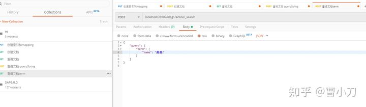

# curl操作

## 通用语句

- 多个索引共同搜索
  
  - `test* 或者*test 或者test*t 或者 *test*或者-test`   (-)是排除

- 日志格式支持
  
  - <静态文本{动态的时间表达式{日期呈现格式|时区}}>
    
    - 最近三天 
    
    ```
    # GET /<logstash-{now/d-2d}>,<logstash-{now/d-1d}>,<logstash-{now/d}>/_search
    GET /%3Clogstash-%7Bnow%2Fd-2d%7D%3E%2C%3Clogstash-%7Bnow%2Fd-1d%7D%3E%2C%3Clogstash-%7Bnow%2Fd%7D%3E/_search
    {
      "query" : {
        "match": {
          "test": "data"
        }
      }
    }
    ```

- 格式化结果
  
  - ?pretty=true
  
  - ?format=yaml
  
  - ?human=false

- 过滤显示结果的字段
  
  - 示例 curl -X GET "localhost:9200/_search?q=elasticsearch&filter_path=took,-_shards，hits.hits._id,hits.hits._score&pretty"

## 文档指令

### 读写文档原理

- 写入单个文档
  
  - 客户端向集群的某个节点发起请求，该节点就是协调节点
  
  - 协调节点根据文档id确定文档所在分片，根据集群路由表信息确定主分片位置，发送请求到主分片所在节点
  
  - 执行主分片写操作；写入成功后并行转发至副本分片所在节点，等所有副本分片都写入成功后，发送报告至协调节点，协调节点发送至客户端

- 写入故障处理 TODO
  
  - 主节点故障
    
    - 给主节点发送确定信息，最多等待1分钟，然后选择其中一个副本提升为新的主副本，将请求发送给新的节点进行处理
  
  - 副本节点故障：只有主分片运行，就会有数据丢失的风险

- 读取单个文档
  
  - 客户端发送请求至某个节点，该节点就是协调节点
  
  - 协调节点根据文档ID确定文档所在分片
  
  - 通过集群状态路由表信息确定副本信息，请求转发至副本分片所在节点读取信息（多个副本分片客户端轮询来负载均衡）
  
  - 副本分片节点返回信息至协调节点，然后返回至客户端

- search文档
  
  - query阶段
    
    - 客户端向集群的某个节点发起请求，该节点就是协调节点
    
    - 协调节点将查询转发至索引的每一个主分片或者副本分片中
    
    - 每个分片本地执行查询，使用本地的term，document frequency信息进行发奋，结果添加到ftrom+size的本地有序优先队列中
    
    - 每个分片返回各自队列的所有文档id和排序值给协调节点，协调节点合并至自己的优先队列中，产生一个全局排序后的列表
  
  - fetch阶段
    
    - 协调节点只要了要获取那些信息，但是还没有具体的数据，需要执行多个get请求获取数据
    
    - 分片所在节点向协调节点返回数据
    
    - 所有数据返回完成，然会给客户端

## 简单操作命令

- 创建索引和mapping
  
  - 

- 删除索引  
  
  

- 创建文档和修改文档
  
  - 

- 查询文档
  
  - 通过id查询
    
    - 
  
  - query-string查询
    
    - 
  
  - term查询
    
    - 
