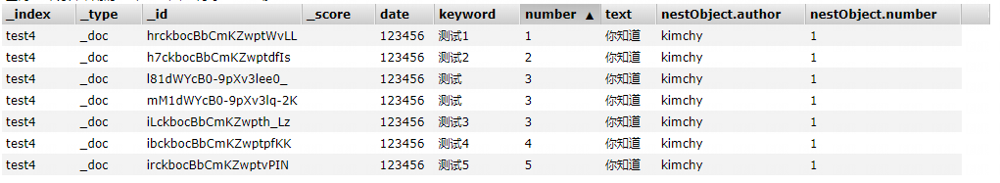

# URI查询

# RequestBody查询

## 基本使用

- 请求体
  
      curl -X GET "localhost:9200/_search?pretty" -H 'Content-Type: application/json' -d'
      {
          "from" : 0, "size" : 10,//分页限制
          "query" : {//条件体
              "term" : { "user" : "kimchy" }
          },
          "sort":[
           { "post_date" : {"order" : "asc"}},
              "user",
              { "name" : "desc" },
              { "age" : "desc" },
              "_score"
           ],
         "_source": ["obj*"],//source显示字段过滤   
         "stored_fields": "_none_",//stored字段过滤
      }
      '

- 返回值
  
      {
          "took": 1,//花费时间
          "timed_out": false,//请求是否超时
          "_shards":{//分片信息
              "total" : 1,
              "successful" : 1,
              "skipped" : 0,
              "failed" : 0
          },
          "hits":{
              "total" : 1,//总数据条数
              "max_score": 1.3862944,//分数
              "hits" : [//详情信息
                  {
                      "_index" : "twitter",
                      "_type" : "_doc",
                      "_id" : "0",
                      "_score": 1.3862944,
                      "_source" : {
                          "user" : "kimchy",
                          "message": "trying out Elasticsearch",
                          "date" : "2009-11-15T14:12:12",
                          "likes" : 0
                      }
                  }
              ]
          }
      }

## sort详解

### mode

    如果字段值是数组类型，排序可选如下模式min,max，sum，avg,median(中位数)

### missing

_last：不存在值的时候排队到尾部
 _first,不存在值的时候排队到头部

### unmapped_type

 {"unmapped_type" : "long"}类型不是long的不参与排序

### script based sorting

如果想根据两个字段的计算值进行结果排序，手动书写script脚本

    curl -X GET "localhost:9200/_search?pretty" -H 'Content-Type: application/json' -d'
    {
        "query" : {
            "term" : { "user" : "kimchy" }
        },
        "sort" : {
            "_script" : {
                "type" : "number",
                "script" : {
                    "lang": "painless",
                    "source": "doc['field_name'].value * params.factor",
                    "params" : {
                        "factor" : 1.1
                    }
                },
                "order" : "asc"
            }
        }
    }
    '

### nest Object

    curl -XGET 'localhost:31600/test1/_search' 
    --data '{
    
        "query" : {
          "match" : { "date" :"123456" }
       },
        "sort" : [
            {"number":{
                "order":"asc", "missing":"_last"
            }},
            { "nestObject.beauty" :{
                 "order":"desc",
                 "missing" : "_last",
                "nested":{
                     "path":"nestObject",
                    "filter": {
                       "match" : { "nestObject.name" :"高珊珊" }
                    }
                }
            }}
      ]
    }'
    
    
    返回说明：name是高珊珊或者不是高珊珊的数据都会返回，filter会影响得分，从而影响返回顺序

### track_scores

排序之后不再进行分数计算，但是添加该参数可以继续进行分数计算，返回示例

配置track_scores=tue返回如图

## post filter

  聚合之后再进行的条件过滤；例如你有衬衣的如下信息：品牌，颜色，样式；你希望通过一个查询可以得出如下结论：A品牌的红色衬衫的详细信息+A品牌的衬衣流行颜色+A品牌红色衬衣流行样式

    curl -X GET "localhost:9200/shirts/_search?pretty" -H 'Content-Type: application/json' -d'
    {
      "query": {
        "bool": {
          "filter": {
            "term": { "brand": "gucci" } 
          }
        }
      },
      "aggs": {
        "colors": {
          "terms": { "field": "color" } 
        },
        "color_red": {
          "filter": {
            "term": { "color": "red" } 
          },
          "aggs": {
            "models": {
              "terms": { "field": "model" } 
            }
          }
        }
      },
      "post_filter": { 
        "term": { "color": "red" }
      }
    }
    '

## Highlight

- 场景：在百度查询的时候你经常会发现搜索结果当中你的查询内容被高亮了，这就是highlight的作用；

- 工作原理
  
  - 字段文本分段
    
    - plain：游标end_offset超过fragment_size乘以创建的片段数量
    
    - unified&fast Vector：java的BreakIterator；只要`fragment_size`允许就会是一个有效句子
  
  - 查询最匹配的分段
    
    - plain：标记流中创建内存索引，执行原始查询条件
    
    - fast Vector：预先索引的术语向量；无需创建内存索引
    
    - Unified highlighter：预先索引的术语向量或预先索引的术语偏移可用即使用，不可用创建内存索引
  
  - 给查询词汇高亮：使用用户设置的高亮原则将查询词汇加上html标签

- 配置
  
  - type:类型unified，plain，fast Vector
  
  - boundary_chars：边界字符（断句字符）：.,!?
  
  - boundary_max_scan：边界字段的距离
  
  - boundary_scanner：边界扫描器
    
    - chars：fvh有效,`boundary_max_scan`控制
    
    - sentence/word：java的BreakIterator；可以设置boundary_scanner_locale
  
  - boundary_scanner_locale
    
    - 使用哪种语言搜索句子边界
  
  - number_of_fragments：返回的最大片段数量
  
  - fragment_size：突出显示片段的大小
  
  - pre_tags：html前标签
  
  - post_tags：html后标签

- 示例
  
    curl -XGET 'localhost:31600/test1/_search' 
    --header 'Content-Type: application/json' 
    --data '{
  
        "query":{
            "match":{
                "text":"中国"
            }
        },
       "highlight" : {
              "type":"unified",
              "boundary_scanner_locale":"zh_CN",  "boundary_scanner":"word",
               "number_of_fragments":3,
            "fields" : {
                "text" : {   
                }
            }
        }
  
    }'

## 分页查询

原理请看https://mp.weixin.qq.com/s/h99sXP4mvVFsJw6Oh3aU5A?  ；优缺点比对如下图

| 查询方式        | 优点         | 缺点                                                           |
| ----------- | ---------- | ------------------------------------------------------------ |
| from+size   | 支持随机翻页     | 最多查询1w条数据 存在深度分页问题，越往后翻译，效率越慢                            |
| scroll      | 遍历全量数据效率最高 | 响应时间非实时 保留上下文需要堆内存空间，不推荐用作实时查询 每次请求都会按照之前的分页信息往下翻滚一页 |
| searchAfter | 无限制翻页      | 只能下一页进行翻页                                                |

### from+size

参见基本使用

### scroll

第一次请求

    curl --location 'http://127.0.0.1:31600/test4/_search?scroll=1m' \
    --header 'Content-Type: application/json' \
    --data '{
        "query":{
            "term":{
                "date":"123456"
            }
        },
        "size":2,
        "sort":{
            "number":{
                "order":"asc"
            }
        }
    
    }   
    返回
    {
        "_scroll_id": "DnF1ZXJ5VGhlbkZldGNoBQAAAAAAAAKaFmJoQ1dGRGZjUWltb0lJWktIcU5ZT1EAAAAAAAACmxZiaENXRkRmY1FpbW9JSVpLSHFOWU9RAAAAAAAAApwWYmhDV0ZEZmNRaW1vSUlaS0hxTllPUQAAAAAAAAKdFmJoQ1dGRGZjUWltb0lJWktIcU5ZT1EAAAAAAAACnhZiaENXRkRmY1FpbW9JSVpLSHFOWU9R",
        "hits": {
            "total": 7,
            "max_score": null,
            "hits": [
                { "number": 1
                },
                {
                 "number": 2
                }
            ]
        }
    }

第二次请求

    curl --location 'http://127.0.0.1:31600/_search/scroll' \
    --header 'Content-Type: application/json' \
    --data '
    {
         "scroll" : "1m", 
        "scroll_id" : "DnF1ZXJ5VGhlbkZldGNoBQAAAAAAAAKkFmJoQ1dGRGZjUWltb0lJWktIcU5ZT1EAAAAAAAACpRZiaENXRkRmY1FpbW9JSVpLSHFOWU9RAAAAAAAAAqYWYmhDV0ZEZmNRaW1vSUlaS0hxTllPUQAAAAAAAAKoFmJoQ1dGRGZjUWltb0lJWktIcU5ZT1EAAAAAAAACpxZiaENXRkRmY1FpbW9JSVpLSHFOWU9R
    " 
    }'
    
    第二次返回
    {
        "_scroll_id": "DnF1ZXJ5VGhlbkZldGNoBQAAAAAAAAKkFmJoQ1dGRGZjUWltb0lJWktIcU5ZT1EAAAAAAAACpRZiaENXRkRmY1FpbW9JSVpLSHFOWU9RAAAAAAAAAqYWYmhDV0ZEZmNRaW1vSUlaS0hxTllPUQAAAAAAAAKoFmJoQ1dGRGZjUWltb0lJWktIcU5ZT1EAAAAAAAACpxZiaENXRkRmY1FpbW9JSVpLSHFOWU9R",
        "hits": {
            "total": 7,
            "max_score": null,
            "hits": [
                {
    
                        "number": 3,
    
                },
                {
    
                        "number": 3,
        }
    }
    第三次返回
    {
        "_scroll_id": "DnF1ZXJ5VGhlbkZldGNoBQAAAAAAAAMeFmJoQ1dGRGZjUWltb0lJWktIcU5ZT1EAAAAAAAADHBZiaENXRkRmY1FpbW9JSVpLSHFOWU9RAAAAAAAAAx0WYmhDV0ZEZmNRaW1vSUlaS0hxTllPUQAAAAAAAAMfFmJoQ1dGRGZjUWltb0lJWktIcU5ZT1EAAAAAAAADIBZiaENXRkRmY1FpbW9JSVpLSHFOWU9R",
        "hits": {
            "total": 7,
            "max_score": null,
            "hits": [
                {
    
                        "number": 3,
    
                },
                {
    
                        "number": 4,
    
                }
            ]
        }
    }

### searchAfter

第一次请求 :同scroll查询

第二次请求

    curl --location 'http://127.0.0.1:31600/test4/_search' \
    --header 'Content-Type: application/json' \
    --data '{
        "query":{
            "term":{
                "date":"123456"
            }
        },    
    //前者是number第一次的值，后面是_id第一次的值 
        "search_after": [    3,
                        "l81dWYcB0-9pXv3lee0_"],
        "size":2,
        "sort":{
            "number":{
                "order":"asc"
            },
    //必须加上全局唯一的值排序（_id），不然number都是3之后，数据有丢失
            "_id":{
                "order":"asc"
            }
        }
    
    }
    '

## Inner hits

 nestObject查询的时候使用：如下nestObject的数据在查询的时候只会返回该条数据[如下图2]，不会返回究竟是数组中的哪条数据被命中了，添加上inner_hits之后便可以看到了[如下图3]

    "nestObject":[{"author":"kimchy","number":1},{"author":"nik9000","number":2}]

## field collapsing

  字段折叠功能实现如下需求：例如搜索关键字鱼，并且希望返回结果按照菜系进行合并去重；如果你想到了分类聚合，它的局限性在于不够精准，无法分页；所以有了这个功能

    curl --location --request GET 'http://127.0.0.1:31600/test4/_search/' \
    --header 'Content-Type: application/json' \
    --data '{
        "query":{
            "term":{
                "text":"text1"
            }
        }, 
        "collapse" : {
            "field" : "keyword" ,//扩展分组下的值
             "inner_hits": {
          "name": "top_rated",
          "size": 3,
          "sort": [
            {
              "number": "asc"
            }
          ]
             }
        },
        "from":0,
        "size":4,//分组的值
        "sort":{
            "number":{
                "order":"asc"
            }
        }
    
    }
    '

## 其他

### explain

  解释score计算的方式

### preference

  指定执行搜索请求的shard

### rescoring：

    curl -X POST "localhost:9200/_search?pretty" -H 'Content-Type: application/json' -d'
    {
       "query" : {
          "match" : {
             "message" : {
                "operator" : "or",
                "query" : "the quick brown"
             }
          }
       },
       "rescore" : {
          "window_size" : 50,//针对于前50条数据重新计算分数
          "query" : {
             "rescore_query" : {
                "match_phrase" : {
                   "message" : {
                      "query" : "the quick brown",
                      "slop" : 2
                   }
                }
             },
             "query_weight" : 0.7,//查询权重
             "rescore_query_weight" : 1.2 //重新查询权重
          }
       }
    }
    '
    注意：计算结果只能使用分数排序，否则会报错

### seq_no_primary_term

返回 "_seq_no"和 "_primary_term"(ES高并发情况下，可以确定数据唯一性),

### version

 返回数据的版本信息

### indices_boot

 为不同的索引设置不同的权重

    curl -X GET "localhost:9200/_search?pretty" -H 'Content-Type: application/json' -d'
    {
        "indices_boost" : {
            "index1" : 1.4,
            "index2" : 1.3
        }
    }
    '

### min_score

 筛选分数大于min_score的文档

    curl -X GET "localhost:9200/_search?pretty" -H 'Content-Type: application/json' -d'
    {
        "min_score": 0.5,
        "query" : {
            "term" : { "user" : "kimchy" }
        }
    }
    '

### _name

 为每一个查询起一个名字，matched_queries返回每条数据究竟命中的是哪个查询条件

    curl -X GET "localhost:9200/_search?pretty" -H 'Content-Type: application/json' -d'
    {
        "query": {
            "bool" : {
                "should" : [
                    {"match" : { "name.first" : {"query" : "shay", "_name" : "first"} }},
                    {"match" : { "name.last" : {"query" : "banon", "_name" : "last"} }}
                ],
                "filter" : {
                    "terms" : {
                        "name.last" : ["banon", "kimchy"],
                        "_name" : "test"
                    }
                }
            }
        }
    }
    '
    返回   
    "hits": [
                {
                    "_index": "test1",
                    "_type": "_doc",
                    "_id": "Ox2nSocB4NIHPjWaJh0e",
                    "_score": 2.554441,
                    "_source": {
                        "date": "123456",
                        "longRange": {
                            "gte": 30,
                            "lte": 50
                        },
                        "keyword": "测试",
                        "number": 3,
                        "text": "你知道"
                    },
                    "matched_queries": [
                        "first"//该条数据命中的是哪个请求
                    ]
                },

# query DSL

## query和filter的区别

query回答查询条件和文件的匹配程度如何？参与分数计算

filter回答文件是否符合查询条款？不参与分数计算

## Match ALL

所有全部文档，分数都为1.0

    curl -X GET "localhost:9200/_search?pretty" -H 'Content-Type: application/json' -d'
    {
        "query": {
            "match_all": {"boost" : 1.2} //boost可以不设置
        }
    }
    '

## 全文搜索

## term搜索

## 组合搜索

## Join搜索

## geo搜索

## 专业搜索

## span搜索
