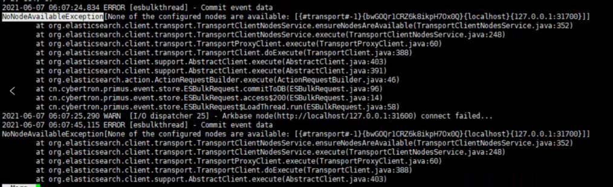

# 问题记录

## es全部数据无法入库

### 现象

ES的集群状态正常，但是数据无法正常入库，运行的tomcat无法连接

### 排查过程：

 1.报错信息




### 原因

  1.查看内存分配32G 

```
ps -ef|grep elasticsearch
```

  2.查看内存占用：21G 

```
curl 'http://localhost:31600/_cat/nodes?v&h=segments.count,segments.memory,segments.index_writer_memory,segments.version_map_memory,segments.fixed_bitset_memory'
```

3. es内存占用说明 ：如果超过分配内存的70%无法保证数据入库
    https://www.elastic.co/guide/en/elasticsearch/guide/master/heap-sizing.html#_just_how_far_under_32gb_should_i_set_the_jvm  
4. es断路器说明  https://www.elastic.co/guide/en/elasticsearch/reference/5.3/circuit-breaker.html

### 解决方案

#### 临时解决：关闭部分在线索引

#### 永久解决：

1.解决方案

 [海燕部署优化方案.pdf](问题记录\1数据无法数据\海燕部署优化方案.pdf) 

2.注意事项

- 扩容后所有索引为green状态

- 每个ES节点s的data目录应该在不同的磁盘：可能会受到IO的限制，读取还是有问题es入门

## es告警数据无法入库

### 现象：

  事件数据可以正常入库查询，告警数据可查询，无法入库

### 排查过程：

    1.查看es集群状态：正常

    2.查看告警索引是否为只读

       cluster.routing.allocation.disk.watermark.low: 85% 将拒绝写入
       cluster.routing.allocation.disk.watermark.high: 90%

     curl -XGET 'localhost:31600/alert_event_v0/_settings?pretty'
    
    curl -XPUT 'localhost:31600/alert_event_v0/_settings' -H 'Content-Type: application/json' -d'{
      "index.blocks.write": false
    }'

    3.排查代码

        入口：cn.cybertron.primus.alert.service.AlertService.insert2db()


   结论：告警数据入库需要判断索引状态，索引状态在项目启动时根据 es的索引模板和索引mapping的初始化情况而定，如果索引模板或者索引初始化失败则无法进行数据入库

   es不可以更新已存在字段的字段类型 [Put Mapping | Elasticsearch Guide [6.8] | Elastic](https://www.elastic.co/guide/en/elasticsearch/reference/6.8/indices-put-mapping.html)

出现原因：在sql当中更新了告警的字段并且在代码中使用，但是没有进行过项目重启

### 解决方案

    更新告警的索引版本
